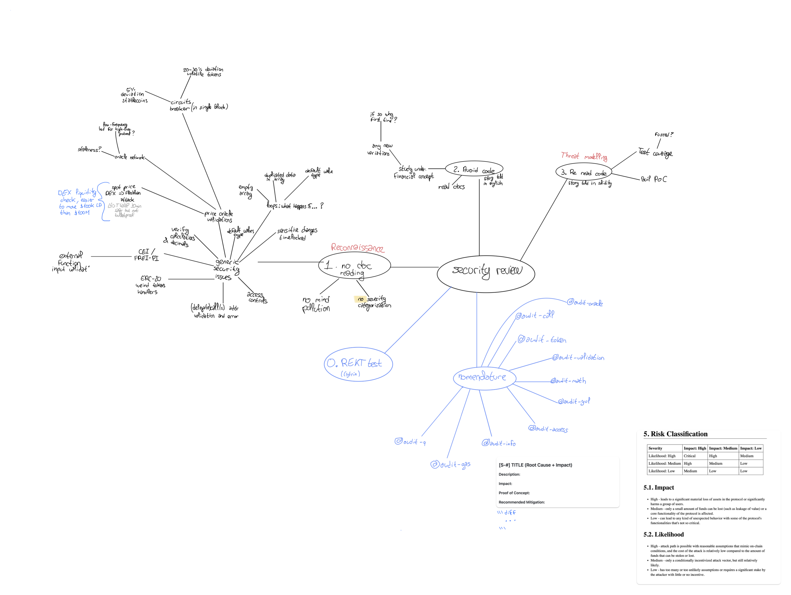

# Review submission

> **Where the work is: the inline `@custom:audit-*` annotations in the source.**
> They are the main output of my hour: 11 in [TransparentUpgradeableProxy.sol](src/TransparentUpgradeableProxy.sol) and 13 in [LendingMarket.sol](src/LendingMarket.sol). They record every question, suspicion and "looks OK because…" from the review, at the exact line it applies to. To list them all:
>
> ```bash
> grep -n "audit" src/*.sol
> ```
>
> Commits `0d63760` (proxy notes) and `7fd3f6d` (market notes) contain just these annotations. The rest of this file summarises them and explains my method.

## Scope note

- **Prioritised:** I reviewed the custom `TransparentUpgradeableProxy` first, before `LendingMarket`. It is not OpenZeppelin's or Solady's battle-tested code, and a bug in the proxy is the only kind that the upgrade path can't fix. Then I did a reconnaissance pass over `LendingMarket` without the docs (access control, oracle, decimal scaling), then read this README quickly to flag where the code disagrees with it. **Deliberately left out:** fixes, tests and severity ratings, because I didn't want to ship fixes I couldn't yet defend at 110%. I also left out the interest/index maths and the financial model.
- **Unsure:** the proxy's Yul `fallback` (hex slots and opcodes make mistakes easy to miss, and admin-call routing looks absent), and whether `onlyGuardian` letting the guardian call `setOracle` is a flaw or stale docs (the README says it is a flaw). With more time I would write the protocol maths in plain notation next to the Solidity, to check decimals and multiply-before-divide.
- **AI tooling:** I didn't use AI or static analysers (Slither, Aderyn, Mythril) to hunt for defects, because I wanted a clear first read. I did use AI for two other things. First, to scan the files I was given for anything malicious before I ran them, which I then checked myself. Second, to turn my notes into this README. <!-- TODO: one AI suggestion you validated / modified / rejected -->

## Repo setup and safety

Before reviewing, I made a few housekeeping commits:

- **Dependencies from a trusted source only** (`03d6639`). I didn't run the vendored `lib/` I was given, even though it looks like `forge-std`. Instead I pulled `forge-std 1.16.2` through Foundry's package manager, Soldeer, from its official registry, and pinned it in [soldeer.lock](soldeer.lock). Before running anything else in the repo, I had AI scan the provided source, scripts and config for malicious code, then checked the result myself.
- **`.gitignore`** for `cache/`, `out/`, `dependencies/` and `.DS_Store`.
- **`forge fmt`** as a separate commit (`756a199`), so the diffs of the annotation commits contain only annotations.

On a normal project I would also bring in the setup from my template, [Theo6890/foundry-hardhat-template](https://github.com/Theo6890/foundry-hardhat-template):

- Config for Slither, Aderyn and Mythril.
- Prettier for Markdown and TypeScript.
- GitHub Actions that run tests and Slither on every PR and on `main`.
- A `main` / `dev` / `feat/*` / `fix/*` branching model.
- commitlint on every commit, so the history stays clean. With AI writing commit messages, this costs little.
- My AI rules files in `.github/instructions/`.

## How I spent the hour

I followed an independent auditor's review process (from a video by [Rahul Saxena](https://www.youtube.com/watch?v=BDtbTCuJoOM)). My written version of it:



**Why the proxy first.** The proxy is custom rather than OpenZeppelin or Solady, and every call and every byte of market state goes through it. If `LendingMarket` has a bug, the admin can upgrade to a fixed implementation, provided the proxy works. If the proxy has a bug (upgrade logic, admin routing, storage slots), it can break the upgrade path itself, and then nothing can be recovered. So a proxy defect has a bigger blast radius than a market defect.

| Step | What | Status |
|---|---|---|
| 1 | Reconnaissance of the code **without** reading the docs. Note questions and suspicions inline | Partial: did not do a thorough market reconnaisance |
| 2 | Read the docs **only**, no code | Partial: a quick README read to flag code vs. doc mismatches |
| 3 | Reread the code **with** the docs in mind. Write the financial model and formulas in plain math with worked examples, and check them line by line against the Solidity (decimals, multiply-before-divide) | Not started |
| 4 | Fix, and prove each fix (these go together) | Not started |
| 5 | Classify severity | Not started |

## What I would do next

1. **Finish steps 2 and 3.** Write the maths out by hand in plain notation, not Solidity, and compare it with the code side by side.
2. **Prove each fix.** Write a failing test or PoC first (AI can help draft it), then fix, then confirm it passes. Rerun the whole suite and use `forge coverage` to find uncovered lines and revert paths.
3. **Fuzz and invariant tests.** Use Foundry stateful fuzzing to chain actions with random inputs, e.g. supply → borrow → another user supplies → time passes → repay. Then check that interest accrues correctly and that invariants hold.
4. **Re-review from the start** with fresh eyes before finalising.
5. **Classify** each finding by impact (H/M/L) × likelihood (H/M/L), giving Critical / High / Medium / Low. Anything else is Informational or Gas.

## Pass-1 observations (unconfirmed, not yet fixed)

These are leads, not validated findings. None has a test or fix yet.

- **Proxy `fallback` has no admin routing** ([TransparentUpgradeableProxy.sol:61-76](src/TransparentUpgradeableProxy.sol#L61-L76)). In a transparent proxy, admin calls should never be delegated to the implementation. I need to check whether this enables selector clashes or admin/implementation confusion.
- **Guardian can change the oracle.** `setOracle` is `onlyGuardian` ([LendingMarket.sol:357-366](src/LendingMarket.sol#L357-L366)). The README says the guardian should only be able to pause the market, and the guardian key is the warmer one. A compromised guardian could set a malicious oracle. Fix I would write: move `setOracle` to `onlyAdmin`. The storage layout does not change.
- **Oracle answer is not validated.** `getPrice()` casts `int256` to `uint256` directly ([LendingMarket.sol:333-337](src/LendingMarket.sol#L333-L337)), so a negative answer wraps to a huge price. There is no staleness check (`updatedAt`) or deviation check. Fix I would write: require `answer > 0`, add a max-age check, and consider a deviation circuit breaker.
- **Initializer has no versioning** ([LendingMarket.sol:104](src/LendingMarket.sol#L104)). It can only run once and has no reinitializer, so any upgrade that adds state cannot be initialised. I need to check how this affects a layout-compatible upgrade.

The other notes are questions and informational: missing events, raw ETH received by the proxy, and slot-hash tests. They are all in the inline annotations (`grep -n "audit" src/*.sol`).
